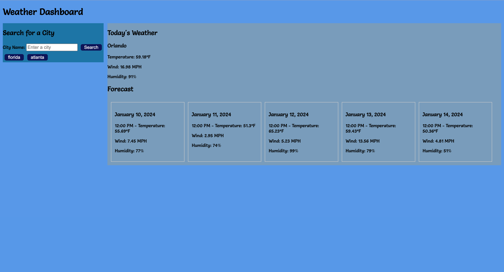

# 6-weatherdash-challengeAPI

Build a weather dashboard that will run in the browser and feature dynamically updated HTML and CSS.

## Tech Used

- HTML

- CSS

- JavaScript

- [5 Day Weather Forecast](https://openweathermap.org/forecast5)

## Screenshots

## Deployed Application
